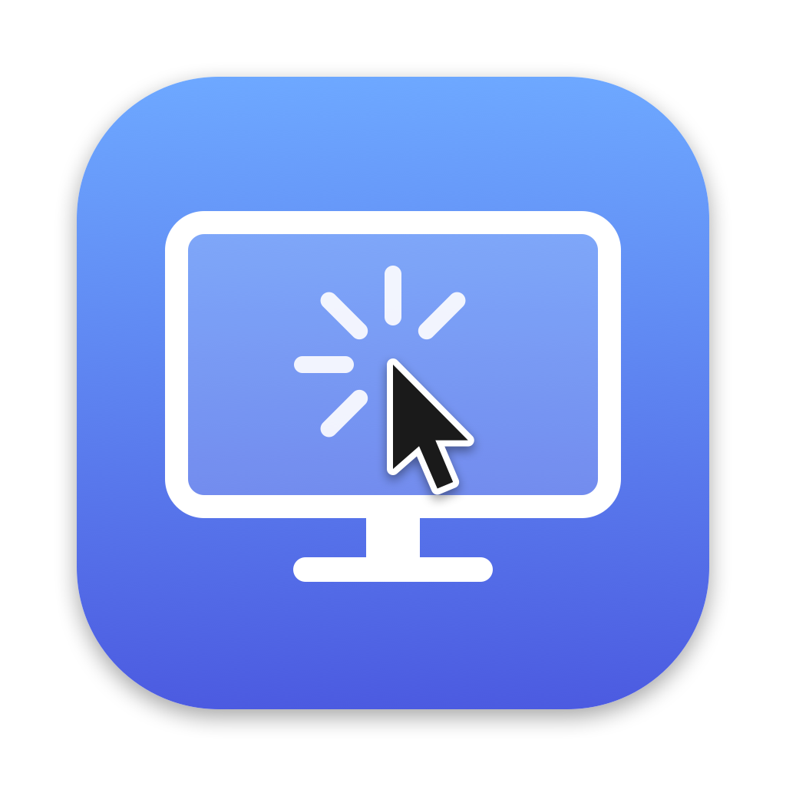

<p align="center">
  
</p>

<h1 align="center">MouseSnap</h1>

<p align="center">
  Jump your cursor between monitors with a keyboard shortcut.<br>
  A tiny menu bar app for multi-monitor Macs.
</p>

---

## Why

With two, three or more displays, getting the cursor to another screen means a long drag across your desk. Worse, you lose track of which screen it's on. MouseSnap gives each monitor its own hotkey:

- **⌃⌥1** moves the cursor to the center of your leftmost monitor.
- **⌃⌥2** moves it to the center of the next one.
- And so on, up to 9 monitors.

The cursor always lands in the middle of the screen, so you know exactly where it is. When you jump to a different monitor, MouseSnap also clicks once where the cursor lands, so the app there is focused and ready to type into.

MouseSnap is built for multi-monitor setups. With a single display, it has nothing to jump between.

## Features

- **One hotkey per monitor:** `modifier + 1…9` jumps to monitor 1–9, numbered left to right like your physical layout.
- **Works across mixed setups:** different resolutions, scaling and arrangements, including monitors above or below each other.
- **Choose the modifier:** ⌃⌥, ⌃⌘, ⌥⌘ or ⌃⇧.
- **Menu bar only:** no Dock icon and no windows.
- **Pick the numbering:** in **Arrange Monitors**, click your monitors in the order you want them numbered, on a layout that matches System Settings → Displays.
- **Monitor list:** the menu shows your connected displays; click one to snap there.
- **Start at Login:** one click in the menu.
- **Focus follows the jump:** a single click on arrival focuses the app on the new monitor. This needs Accessibility permission, which macOS asks for on first launch. Without it, the cursor still moves but nothing is clicked.
- **Small:** a single Swift file, no dependencies, about 80 KB.

## Requirements

- macOS 13 Ventura or later, Apple silicon or Intel

## Install

### Homebrew (recommended)

```bash
brew install --cask raoulius/tap/mousesnap
open /Applications/MouseSnap.app
```

### Download

1. Download `MouseSnap.zip` from the [latest release](https://github.com/raoulius/mousesnap/releases/latest).
2. Unzip it and move `MouseSnap.app` to `/Applications`.
3. MouseSnap isn't notarized by Apple, so macOS blocks the first launch. Right-click the app, choose **Open**, then confirm. Alternatively, run:
   ```bash
   xattr -dr com.apple.quarantine /Applications/MouseSnap.app
   ```

### Build from source

Requires Xcode Command Line Tools (`xcode-select --install`).

```bash
git clone https://github.com/raoulius/mousesnap.git
cd mousesnap
./build.sh
cp -R MouseSnap.app /Applications/
open /Applications/MouseSnap.app
```

Then turn on **Start at Login** from the menu bar icon.

## Updating

MouseSnap checks GitHub for a new release when it launches and once a day after that. When one is available, the menu shows **Update to vX.Y.Z…**. You can also check at any time with **Check for Updates…**. The menu shows your installed version at the bottom.

**Installed with Homebrew:**

```bash
brew upgrade --cask mousesnap
open /Applications/MouseSnap.app
```

Homebrew quits MouseSnap during the upgrade, so reopen it afterwards. If you choose **Update to vX.Y.Z…**, MouseSnap detects the Homebrew install and offers to copy this command.

**Downloaded:** **Update to vX.Y.Z…** opens the release page. Download the new zip and replace the app in `/Applications`.

After an update, macOS stops honoring the Accessibility permission, even though MouseSnap still looks switched on in the list. The first time a new version launches without the permission, MouseSnap opens a short guide. It links to the right Settings page and shows which buttons to click: remove MouseSnap with **–**, add it back, and switch it on. You can reopen the guide at any time from **⚠︎ Allow Accessibility…** in the menu, which only appears while the permission isn't working.

## Usage

| Shortcut | Action |
| --- | --- |
| `⌃⌥1` | Snap to the center of the leftmost monitor |
| `⌃⌥2` | Snap to the center of the next monitor to the right |
| … | … |
| `⌃⌥9` | Snap to the center of monitor 9 |

To use a different modifier, open **Shortcut** in the menu bar icon's menu.

### Choosing which monitor is which number

Open **Arrange Monitors…** from the menu bar icon. It shows your monitors where they sit, like System Settings → Displays, each with its wallpaper. Click them in the order you want: the first click becomes shortcut 1, the next becomes 2, and so on. Clicking a numbered monitor again removes it from the order. While the window is open, each physical monitor shows its number and name, so you can match the tiles to your desk.

The order is saved per monitor, so it survives restarts and unplugging. By default, before you set an order, monitors are numbered left to right. A monitor you connect later that isn't in your order comes after the others.

## How it works

- Hotkeys use Carbon's `RegisterEventHotKey`, which works system-wide without Accessibility permission.
- The cursor moves with `CGWarpMouseCursorPosition`.
- The click on arrival is a posted `CGEvent` mouse down/up, which needs Accessibility permission. `build.sh` signs ad hoc, so after a rebuild macOS may stop honoring the old grant: remove MouseSnap under System Settings → Privacy & Security → Accessibility and add it again.
- Start at Login uses `SMAppService`.

## Releasing

Push a version tag:

```bash
git tag v1.1.0 && git push origin v1.1.0
```

The [Release workflow](.github/workflows/release.yml) builds a universal app with that version number, zips it and publishes a GitHub release with `MouseSnap.zip` attached. Installed copies see the new release within a day.

Within 6 hours, the [tap's Bump workflow](https://github.com/raoulius/homebrew-tap/blob/main/.github/workflows/bump.yml) points the Homebrew cask at the new release. To make `brew upgrade` see it right away, run:

```bash
gh workflow run bump.yml -R raoulius/homebrew-tap
```

## Building the icon

The icon is drawn in code. To regenerate `AppIcon.icns` and `AppIcon.png`:

```bash
swift icon.swift
```

## Project layout

```
main.swift    the app
icon.swift    generates the app icon
build.sh      compiles and bundles MouseSnap.app (universal, ad-hoc signed)
.github/      release workflow
```
